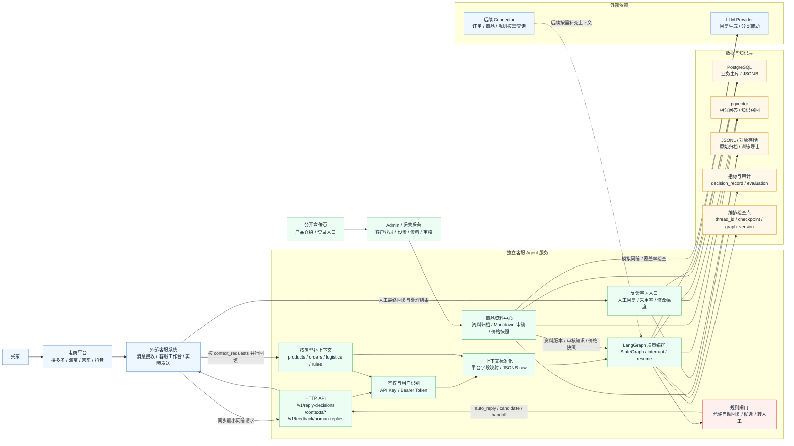
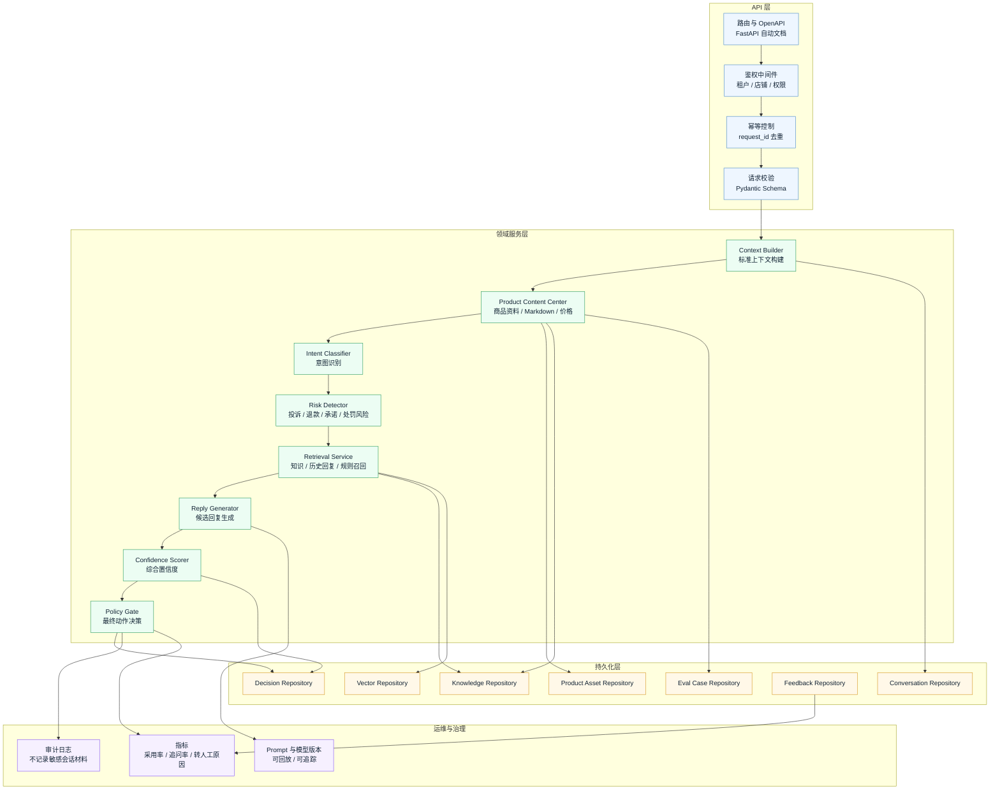
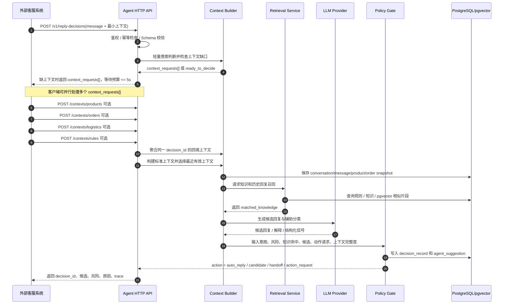
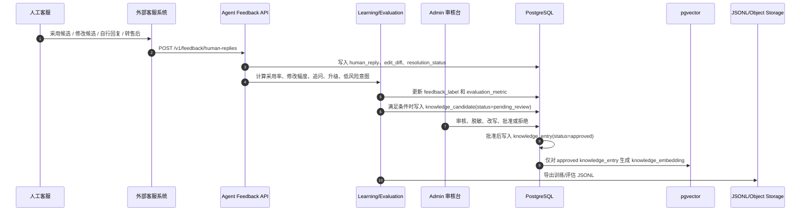
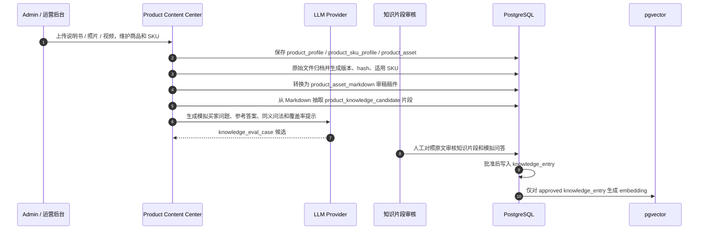
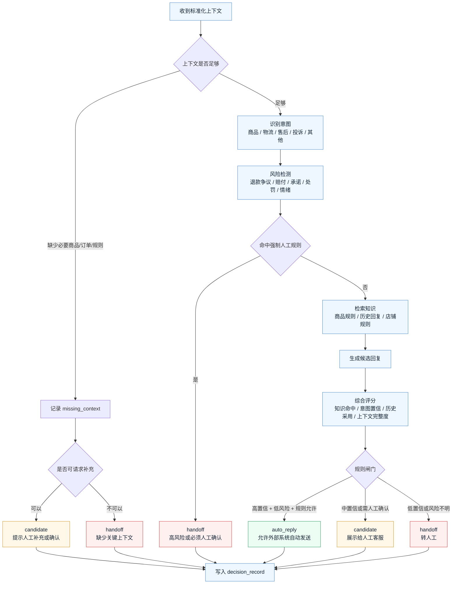
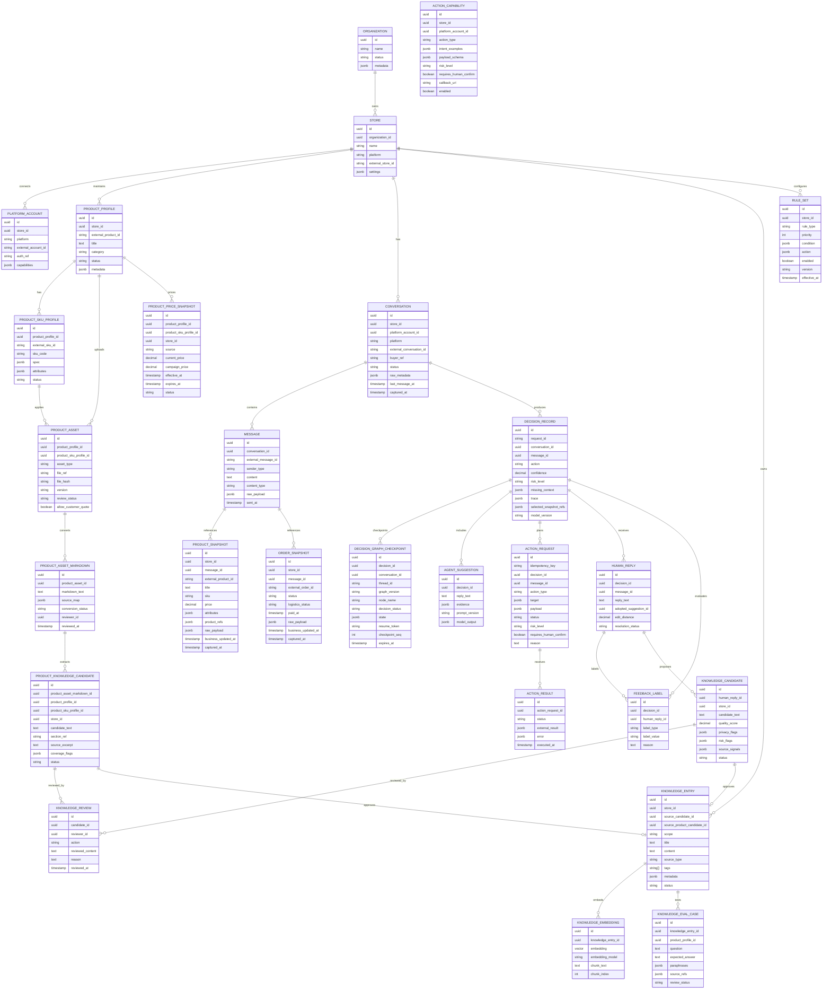
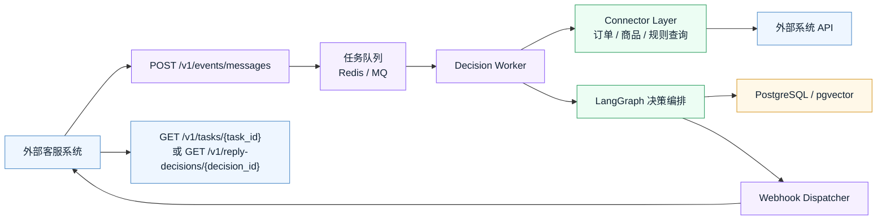
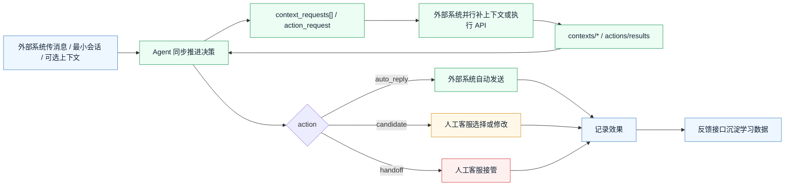

# System Architecture

本文件描述电商客服 Agent 独立系统的整体架构、应用组件、技术栈、数据流、数据模型和决策机制。它基于当前已确认的方向：

交互式 HTML 版本见 [System Architecture HTML](system-architecture.html)。客户可登录后台的详细设计见 [Customer Admin Design](customer-admin-design.md)。

- 系统独立部署，对外提供标准 HTTP API。
- 任一外部客服、ERP、订单、仓储或平台接入系统都可以通过标准 API 单独接入；ERP 只是外部系统的一种示例，不是默认上游或必需组件。
- 第一版同步优先：外部系统调用 `POST /v1/reply-decisions` 获取候选回复或自动回复决策。
- 第一版请求只要求最小问答字段：消息、会话、租户、店铺、平台和模式；商品、订单、物流、规则按需可选传入或通过 typed context refill 补齐。
- 内部决策编排采用 LangGraph 设计：用 StateGraph 表达意图识别、缺上下文判断、RAG、生成、规则闸门、动作等待和人工介入；对外 API 不暴露 LangGraph 概念。
- 第一版提供 Agent 自有公开宣传页 `/`、登录页 `/login` 和受保护后台 `/admin`；宣传页只作为产品介绍和登录入口，不承载租户业务数据。
- 第一版包含 Agent 自有客户 Admin 后台，用于登录、组织/店铺切换、商品资料维护、知识审核、规则配置、动作能力配置和审计查询，不由外部系统承载。
- 公开宣传页 UI 由 Notion 主导：黑白中性基调、大留白、AI Agent 叙事、产品预览和黑色主 CTA；Admin Web UI 仍采用 IBM / Carbon 企业后台结构，Ant Design 只是组件能力层，不是视觉风格来源。
- 后续预留 Connector、异步事件、回调、规则灰度和学习评估闭环。

## 1. 总体架构



核心边界：

- 外部客服系统仍然是平台消息和实际发送动作的所有者。
- 公开宣传页和 Admin 后台属于 Agent 自身；未登录访问 `/admin` 必须回到 `/login`。
- Agent 服务只输出决策建议，不直接绕过外部系统给买家发消息。
- 第一版不要求 Agent 主动登录或读取各平台后台，避免认证和合规复杂度。
- 自动回复必须由规则闸门放行，模型生成内容本身不能直接代表可发送。

## 2. 应用组件



| 组件 | 职责 | 第一版实现 |
| --- | --- | --- |
| API Router | 暴露 `/v1` HTTP API 和 OpenAPI 文档 | FastAPI 路由 |
| Auth Middleware | 识别接入方、组织、店铺权限 | API Key 或 Bearer Token |
| Idempotency | 防止外部系统重试产生重复决策 | `request_id` 唯一约束 |
| Context Builder | 把最小问答请求、可选已有上下文和按类型回填上下文合成标准上下文，并选择最近有效上下文 | Pydantic schema + JSONB raw |
| Context Refill API | 按 `context_requests[]` 接收商品、订单、物流、规则和动作执行结果回填，并聚合同一 `decision_id` | FastAPI 路由 + 幂等约束 |
| LangGraph Decision Orchestrator | 用状态图编排意图识别、缺上下文等待、RAG、生成、动作结果、人工介入和规则闸门；每个节点映射到 trace step | LangGraph StateGraph + PostgreSQL/Redis checkpointer |
| Product Content Center | 管理客户上传的说明书、照片、SKU 资料、Markdown 审稿稿件、知识片段候选、模拟问答和价格快照 | 客户 Admin 后台 + PostgreSQL + 对象存储 |
| Intent Classifier | 判断问题类型，如商品参数、物流、售后、投诉 | 规则优先，LLM 辅助 |
| Risk Detector | 识别退款争议、赔付承诺、辱骂、处罚风险 | 关键词 + 规则 + LLM 辅助 |
| Retrieval Service | 召回知识、历史人工回复、商品规则 | PostgreSQL + pgvector |
| Reply Generator | 生成候选回复，不决定是否发送 | LLM 结构化输出 |
| Capability Registry | 保存平台级 / 店铺级外部能力清单和自然语言触发表达 | DB 配置 + Pydantic schema |
| Action Planner | 把用户操作意图转成稳定 `action_type` 和结构化 `payload` | 规则优先，LLM 辅助抽参 |
| Confidence Scorer | 综合知识命中、风险、历史采用率等信号 | 代码评分函数 |
| Policy Gate | 输出 `auto_reply`、`candidate` 或 `handoff` | 代码规则闸门 |
| Feedback Service | 记录人工最终回复和处理结果 | HTTP 反馈接口 |
| Metrics/Evaluation | 衡量采用率、追问率、误判率 | PostgreSQL 起步，后续 ClickHouse |

## 3. 推荐技术栈

第一版推荐偏 Python 服务栈，因为 Agent、RAG、模型调用和数据处理生态更直接。若团队主力是 TypeScript，可以用 NestJS 替换 API 层，但领域边界和数据模型不变。

| 层 | 推荐技术 | 说明 |
| --- | --- | --- |
| HTTP API | Python 3.12 + FastAPI | 自动生成 OpenAPI，适合标准 HTTP 接入 |
| Schema 校验 | Pydantic v2 | 请求、响应、内部上下文对象强校验 |
| 服务运行 | Uvicorn / Gunicorn | 简单可靠，便于容器化 |
| 主存储 | PostgreSQL 16+ | 会话、消息、决策、反馈、规则主数据 |
| 半结构化字段 | PostgreSQL JSONB | 保存平台差异字段、原始上下文、扩展 metadata |
| 向量检索 | pgvector | 第一版支持相似问答和知识片段召回 |
| ORM/迁移 | SQLAlchemy + Alembic | 保持 schema 演进可控 |
| LLM 访问 | Provider Adapter | 屏蔽 OpenAI-compatible、本地模型或多供应商差异 |
| Agent 编排 | LangGraph StateGraph | 内部编排决策状态、条件边、interrupt/resume、节点 trace 和 checkpoint |
| 决策规则 | 代码规则 + DB 配置 | 第一版便于调试，后续可演进 OPA/Rego |
| 异步任务 | 第一版不强依赖；后续 Redis + Celery/Dramatiq | 用于异步事件、批量学习、回调重试 |
| 观测 | Structured logging + OpenTelemetry + Prometheus | 跟踪请求、决策耗时、错误和业务指标 |
| 文档 | OpenAPI + Markdown 架构文档 | 对外接入和内部实现分开维护 |

## 3.1 核心数据库结构

第一版数据库不只存聊天文本，而是按“租户隔离、上下文快照、决策审计、知识召回、人工反馈”拆表。核心表建议如下：

| 表 | 主键 / 唯一键 | 关键外键 | 关键字段 |
| --- | --- | --- | --- |
| `organization` | `id` | - | `name`、`status`、`metadata JSONB` |
| `store` | `id` | `organization_id` | `name`、`platform`、`external_store_id`、`settings JSONB` |
| `platform_account` | `id` | `store_id` | `platform`、`external_account_id`、`auth_ref`、`capabilities JSONB` |
| `product_profile` | `id`；`(store_id, external_product_id)` | `store_id` | `title`、`category`、`status`、`description`、`metadata JSONB`、`updated_at` |
| `product_sku_profile` | `id` | `product_profile_id` | `external_sku_id`、`sku_code`、`spec JSONB`、`attributes JSONB`、`status` |
| `product_asset` | `id` | `product_profile_id`、`product_sku_profile_id` | `asset_type`、`file_ref`、`file_hash`、`version`、`review_status`、`allow_customer_quote` |
| `product_asset_markdown` | `id` | `product_asset_id` | `markdown_text`、`source_map JSONB`、`conversion_status`、`reviewer_id`、`reviewed_at` |
| `product_price_snapshot` | `id` | `product_profile_id`、`product_sku_profile_id`、`store_id` | `source`、`current_price`、`campaign_price`、`effective_at`、`expires_at`、`external_updated_at`、`status` |
| `conversation` | `id`；`(store_id, platform, external_conversation_id)` | `store_id`、`platform_account_id` | `buyer_ref`、`status`、`raw_metadata JSONB`、`last_message_at`、`captured_at` |
| `message` | `id`；`(conversation_id, external_message_id)` | `conversation_id` | `sender_type`、`content`、`content_type`、`raw_payload JSONB`、`sent_at` |
| `product_snapshot` | `id` | `store_id`、`message_id` | `external_product_id`、`title`、`sku`、`price`、`attributes JSONB`、`product_refs JSONB`、`raw_payload JSONB`、`business_updated_at`、`captured_at` |
| `order_snapshot` | `id` | `store_id`、`message_id` | `external_order_id`、`status`、`logistics_status`、`paid_at`、`raw_payload JSONB`、`business_updated_at`、`captured_at` |
| `decision_record` | `id`；`request_id` | `conversation_id`、`message_id` | `action`、`confidence`、`risk_level`、`missing_context JSONB`、`trace JSONB`、`selected_snapshot_refs JSONB`、`model_version` |
| `decision_graph_checkpoint` | `id`；`(decision_id, checkpoint_seq)` | `decision_id`、`conversation_id` | `thread_id`、`graph_version`、`node_name`、`decision_status`、`state JSONB`、`resume_token`、`expires_at` |
| `agent_suggestion` | `id` | `decision_id` | `reply_text`、`evidence JSONB`、`prompt_version`、`model_output JSONB` |
| `action_capability` | `id` | `store_id`、`platform_account_id` | `action_type`、`intent_examples JSONB`、`payload_schema JSONB`、`risk_level`、`requires_human_confirm`、`callback_url`、`enabled` |
| `action_request` | `id`；`idempotency_key` | `decision_id`、`message_id` | `action_type`、`target JSONB`、`payload JSONB`、`status`、`risk_level`、`requires_human_confirm`、`reason` |
| `action_result` | `id` | `action_request_id` | `status`、`external_result JSONB`、`error JSONB`、`executed_at` |
| `human_reply` | `id` | `decision_id`、`message_id` | `reply_text`、`adopted_suggestion_id`、`edit_distance`、`resolution_status` |
| `feedback_label` | `id` | `decision_id`、`human_reply_id` | `label_type`、`label_value`、`reason`、`created_by` |
| `knowledge_candidate` | `id` | `human_reply_id`、`store_id` | `candidate_text`、`quality_score`、`privacy_flags JSONB`、`risk_flags JSONB`、`source_signals JSONB`、`status` |
| `product_knowledge_candidate` | `id` | `product_asset_markdown_id`、`product_profile_id`、`store_id` | `candidate_text`、`section_ref`、`source_excerpt`、`qa_intent`、`coverage_flags JSONB`、`risk_flags JSONB`、`status` |
| `knowledge_review` | `id` | `candidate_id` 或 `product_candidate_id` | `reviewer_id`、`action`、`reviewed_content`、`reason`、`reviewed_at` |
| `knowledge_entry` | `id` | `store_id`、`source_candidate_id` 或 `source_product_candidate_id` | `scope`、`title`、`content`、`source_type`、`tags TEXT[]`、`metadata JSONB`、`status` |
| `knowledge_embedding` | `id` | `knowledge_entry_id` | `embedding vector`、`embedding_model`、`chunk_text`、`chunk_index` |
| `knowledge_eval_case` | `id` | `knowledge_entry_id`、`product_profile_id` | `question`、`expected_answer`、`paraphrases JSONB`、`source_refs JSONB`、`coverage_flags JSONB`、`review_status` |
| `rule_set` | `id` | `store_id` | `rule_type`、`priority`、`condition JSONB`、`action JSONB`、`enabled`、`version`、`effective_at` |

关键约束：

- 所有业务表带 `organization_id` 或可通过 `store_id` 回溯到租户，避免跨店铺串数据。
- 外部幂等靠 `request_id`、`external_message_id`、`external_conversation_id` 唯一约束，不靠文本去重。
- 商品资料以 `product_profile`、`product_sku_profile`、`product_asset` 管理；原始文件必须保留，Markdown 只是审稿稿件，不直接作为自动回复知识源。
- 价格以外部系统当前有效 `product_price_snapshot` 为权威；ERP、平台或其他业务系统都只是价格来源示例。价格缺失、过期或冲突时，Agent 不自动报价。
- 商品、订单、平台原始请求都保留在 JSONB 快照里，回放决策时不依赖外部系统当前状态。
- 实时性上下文每次请求新增快照，不覆盖旧快照；当前决策只引用 Context Builder 选出的最近有效商品、订单、规则、商品资料版本、价格快照和会话摘要。
- 自然语言动作配置只用于意图识别；真正请求外部系统执行时必须落到稳定 `action_type`、结构化 `payload` 和幂等键。
- 外部动作必须记录 `action_request` 和 `action_result`；没有执行成功回调前，Agent 不能向买家确认“已完成”。
- LangGraph graph state 必须通过 `decision_graph_checkpoint` 或等价外部 checkpointer 持久化，禁止依赖单容器内存；`decision_id` 映射 graph `thread_id`，`graph_version` 支持后续状态 schema 演进。
- `decision_record.trace` 必须记录规则命中、知识来源、商品资料版本、价格快照、模拟问答案例、模型版本、风险原因、缺失上下文和可渲染的 `trace.steps`。
- `human_reply` 只保存人工最终回复；第一版不直接把客服回复写入 `knowledge_entry` 或 `knowledge_embedding`。
- `knowledge_candidate` 是半自动知识沉淀的中间态，只保存质量信号较好的待审核知识。
- `product_knowledge_candidate` 是从商品资料 Markdown 抽取出的待审核片段，必须人工按片段对照原文审核。
- `knowledge_entry` 只保存 Admin 审核通过后的可复用知识；`knowledge_embedding.embedding` 只为 approved knowledge 生成。
- `knowledge_eval_case` 保存 LLM 生成并经人工确认的模拟问题、参考答案和同义问法，用于覆盖率检查和回归评测。

## 4. 同步决策数据流



第一版同步链路的关键目标是可解释和可回放：同一条消息为什么给候选、为什么自动回复、为什么转人工，都应能通过 `decision_record` 查回当时的上下文、规则命中、模型版本和处理步骤。

实时性内容的更新替换发生在标准化阶段，而不是覆盖历史数据。外部系统可以在主请求里传已有的 `products`、`orders`、`logistics`、规则列表和会话摘要，也可以在收到 `context_requests[]` 后按类型回填。Context Builder 先识别当前消息显式提到的商品或订单，再按业务更新时间选择最近有效项。可用时间字段优先级为外部业务更新时间、规则 `effective_at` / 版本生效时间、消息时间，最后才是 Agent 接收时的 `captured_at`。本轮被选中的快照 ID 写入 `decision_record.trace.selected_snapshot_refs`，候选数量、选择依据和被替换的旧引用写入 trace，确保连续聊天涉及多个订单或商品时，当前回复面向最近上下文，历史回放仍能看到旧上下文。

外部动作类需求走“能力清单 + 动作请求 + 执行结果”的闭环。Admin 可以在平台级或店铺级配置自然语言触发表达，例如“改备注”“帮我备注”映射到 `update-note`，“改地址”“收货地址换成”映射到 `update-address`；店铺级配置优先于平台级配置。Agent 识别动作意图后，先检查能力清单和上下文是否足够；缺订单时返回 `context_requests[type=orders]` 请求外部系统补查订单；上下文足够时生成 `action_request`，由外部系统按 `action_type` 调自己的真实 API。外部系统通过 `POST /v1/reply-decisions/{decision_id}/actions/results` 回传 `action_result` 成功后，Agent 才生成完成确认；失败、超时或高风险动作未确认时，只能给候选回复或转人工。

典型“订单备注”交互：

```text
买家: 帮我备注一下，要红色
Agent: 识别 update-note -> 需要 order_id -> 当前上下文 unknown
Agent -> 外部系统: context_requests[{type=orders, endpoint=/contexts/orders}]
外部系统 -> Agent: POST /v1/reply-decisions/{decision_id}/contexts/orders 返回最近订单 orders[]
Agent: 选择最近有效订单 order-123，抽取 note=要红色
Agent -> 外部系统: action_request(action_type=update-note, order_id=order-123, note=要红色)
外部系统: 调用自己的订单备注 API
外部系统 -> Agent: POST /v1/reply-decisions/{decision_id}/actions/results action_result(status=succeeded)
Agent: 生成最终回复“已帮您备注‘要红色’。”
```

### 4.1 LangGraph 决策编排

LangGraph 作为内部 `Decision Orchestrator`，不改变对外 HTTP API。外部系统仍只看到 `POST /v1/reply-decisions`、`context_requests[]`、typed context refill、`action_request`、`actions/results` 和 `message-traces`。

推荐 graph state：

```text
thread_id = decision_id
graph_version
organization_id / store_id / platform
conversation_ref / message_ref
messages[]
selected_snapshot_refs
product_context_refs[]
order_context_refs[]
logistics_context_refs[]
rule_refs[]
missing_context[]
context_requests[]
action_requests[]
action_results[]
candidate_replies[]
risk_flags[]
decision_status
trace_steps[]
```

核心节点建议：

| LangGraph 节点 | 职责 | 可中断 / 恢复点 |
| --- | --- | --- |
| `ingest_request` | 接收最小问答请求，创建 `decision_id` 和初始 graph state | 否 |
| `context_gap_check` | 轻量判断当前问题需要哪些商品、订单、物流或规则上下文 | 缺上下文时返回 `context_requests[]` |
| `merge_context_refill` | 合并 `/contexts/*` 回填数据，选择最近有效快照 | 部分回填时保持 `partial_context` |
| `intent_and_risk` | 规则优先识别意图和风险，LLM 只做辅助分类 | 高风险可直接 `handoff` |
| `retrieval` | 召回审核通过知识、商品知识、规则和历史人工回复 | 否 |
| `reply_generation` | 生成候选回复，不决定是否可自动发送 | 否 |
| `action_planning` | 把“改备注”“改地址”等诉求转成 `action_request` | 等待外部 `actions/results` |
| `policy_gate` | 规则闸门最终输出 `auto_reply`、`candidate` 或 `handoff` | 人工确认可作为 interrupt |
| `persist_trace` | 将节点输入输出引用、耗时、错误和降级原因写入 `decision_record.trace.steps` | 否 |

落地规则：

- LangGraph state 只保存引用、状态和结构化中间结果；原始消息、商品、订单、物流、规则和知识正文仍落业务表或对象存储。
- 每个 graph 节点必须输出可映射到 `decision_record.trace.steps[]` 的 step 记录。
- `decision_id` 是外部 API 主键，也是 graph `thread_id`；补上下文和动作结果只恢复同一个 thread，不新建决策。
- `graph_version` 必须写入 checkpoint 和 trace，避免后续节点、状态 schema 变化导致旧决策无法回放。
- API 服务保持 k8s 无状态；LangGraph checkpoint 使用 PostgreSQL、Redis 或等价外部存储，不能使用进程内内存作为生产状态。
- 规则闸门仍是最终自动回复放行点。LangGraph 负责编排，不替代规则、权限、价格权威来源或人工审核。

## 5. 消息追踪信息流

单条客服消息必须能从外部系统消息 ID 或 Agent 决策 ID 追到完整处理过程。查询入口建议为：

```text
GET /v1/message-traces/{decision_id}
```

可选查询参数包括 `message_id`、`external_message_id` 和 `request_id`，用于外部客服系统只有平台消息 ID 或幂等键时定位记录。

```mermaid
flowchart LR
  Lookup["查询入口\nGET /v1/message-traces/{decision_id}"] --> Msg["消息定位\nmessage_id / external_message_id / request_id"]
  Msg --> Ingest["ingest\n原始消息 / 商品 / 订单 / 规则摘要"]
  Ingest --> Normalize["normalization\n字段映射 / 缺失上下文 / raw payload 引用"]
  Normalize --> Retrieval["retrieval\n知识 / 历史回复 / 规则 / 相似度"]
  Retrieval --> Generation["generation\n模型版本 / prompt 版本 / 候选回复"]
  Generation --> Policy["risk_and_policy\n风险标记 / 规则命中 / action"]
  Policy --> Trace["decision_record.trace.steps\nstep_id / status / 输入输出引用"]
  Trace --> Persist["persistence\nconversation / message / decision_record / suggestion"]
  Persist --> Feedback["feedback\n采用 / 修改 / 最终回复 / 追问升级"]
  Feedback --> UI["消息详情信息流图\n失败点 / 降级点 / 耗时"]

  classDef external fill:#eef6ff,stroke:#4f8cc9,color:#123;
  classDef service fill:#ecfdf3,stroke:#2f9e62,color:#123;
  classDef data fill:#fff8e8,stroke:#d79a2b,color:#123;
  classDef risk fill:#fff0f0,stroke:#d64545,color:#123;
  class Lookup,UI external;
  class Msg,Ingest,Normalize,Retrieval,Generation service;
  class Trace,Persist,Feedback data;
  class Policy risk;
```



`decision_record.trace.steps` 建议使用统一步骤结构，便于 API 和前端信息流转图复用：

| 字段 | 说明 |
| --- | --- |
| `step_id` | 稳定步骤 ID，如 `api_check`、`context_builder`、`retrieval`、`policy_gate` |
| `name` | 面向运营和排障人员的步骤名称 |
| `status` | `completed`、`skipped`、`degraded`、`failed` |
| `started_at` / `ended_at` | 步骤耗时与排障时间线 |
| `inputs_ref` | 输入引用，如 `message:msg-001`、`rule_set:shipping-v3` |
| `outputs_ref` | 输出引用，如 `knowledge_entry:faq-123`、`agent_suggestion:sug-001` |
| `error` | 失败或降级原因；成功时为空 |

返回数据按信息流分段：`ingest`、`normalization`、`retrieval`、`generation`、`risk_and_policy`、`persistence`、`feedback`。默认响应只返回摘要、引用 ID、命中原因和审计元数据；完整 raw payload 只给内部排障权限。

`normalization` 段应额外展示实时上下文选择结果：同类商品、订单、规则和会话摘要的候选数量、最终选中的快照引用、时间字段来源，以及上一轮已被替换但仍保留的旧快照引用。

消息详情页的可视化重点不是聚合 BI，而是回答三类单条消息问题：

- 为什么转人工：看 `missing_context`、`risk_flags`、P0/P1 规则命中和失败步骤。
- 为什么候选不自动发：看置信度、知识来源、上下文完整度和规则闸门结果。
- 为什么回复错了：看当时商品/订单快照、知识召回、模型输出和人工反馈。

## 6. 人工反馈与学习数据流



第一版建议先做半自动知识沉淀，不做全自动沉淀。人工客服的回复先全部记录到 `human_reply`，系统只根据质量信号筛出 `knowledge_candidate`，必须经过 Admin 人工确认后才进入 `knowledge_entry` 和 `knowledge_embedding`。

不要第一版就自动把所有客服回复塞进向量库，原因是客服回复可能包含临时口径、订单号、手机号、地址等隐私，也可能是针对单个用户的特殊处理或错误承诺；一旦进入 RAG 知识库，错误会被反复引用并放大。

第一阶段更重要的是把人工反馈变成结构化资产：

- 哪些候选被直接采用。
- 哪些候选被大幅修改。
- 哪些问题被转人工或转售后。
- 哪些自动回复之后继续被追问。
- 哪些店铺、商品、平台场景最适合自动化。
- 哪些低风险人工回复可以进入 `knowledge_candidate` 等待审核。

## 7. 商品资料与知识审核流

客户销售的商品会持续变化，说明书、产品照片、SKU 规格和价格不能只作为聊天上下文临时传入。第一版应建立公开宣传页、客户 Admin 后台和商品资料中心，由客户从宣传页登录进入后台后维护资料、知识审核、规则和动作能力；Agent 只使用结构化资料、审核通过知识和当前有效价格快照。后台登录、权限、设置项和审计设计见 [Customer Admin Design](customer-admin-design.md)。



关键规则：

- 原始说明书、照片和视频必须保留在 `product_asset`，用于审计、重新解析和版本回放。
- Markdown 是人工对照审核的中间稿件，不直接作为自动回复知识源。
- 知识库只接收人工审核通过的知识片段，不接收整篇未审核 Markdown。
- LLM 可以生成模拟问答、同义问法、覆盖率提示和客服口吻改写，但不能最终批准知识入库。
- 产品照片第一版只维护类型、SKU、说明、审核状态和是否允许引用，不直接驱动自动回复。
- 价格类回答只使用外部系统当前有效 `product_price_snapshot`；价格缺失、过期或冲突时不自动报价。
- 资料体检应向客户展示缺说明书、缺 SKU 图、价格过期、知识未审核、解析失败、信息冲突等状态。

`decision_record.trace.selected_snapshot_refs` 应记录本次决策使用的商品资料版本、SKU 资料、价格快照、知识条目和模拟问答案例。这样价格、说明书或知识后续更新后，仍可回放当时为什么给候选、为什么自动回复或为什么转人工。

## 8. 决策机制

### 8.1 决策总流程



### 8.2 规则优先级

决策不能只看模型置信度，必须按规则优先级处理。

| 优先级 | 规则类型 | 结果 |
| --- | --- | --- |
| P0 | 平台处罚风险、投诉升级、赔付承诺、退款争议、辱骂威胁 | 强制 `handoff` |
| P1 | 需要订单/物流数据但上下文缺失 | `candidate` 或 `handoff`，禁止猜测 |
| P2 | 商品参数、尺码、库存、发货时间等低风险问题 | 满足阈值可 `auto_reply` |
| P3 | 知识命中中等、历史采用率不足、新商品或新规则 | `candidate` |
| P4 | 闲聊、无明确意图、多轮上下文断裂 | `handoff` 或请求人工确认 |

### 8.3 置信度评分

第一版可以使用可解释的加权评分，不依赖模型自评直接放行。

```text
confidence =
  0.30 * knowledge_match_score
+ 0.20 * intent_score
+ 0.20 * historical_acceptance_score
+ 0.15 * context_completeness_score
+ 0.15 * answer_quality_score
- risk_penalty
```

建议初始门槛：

| 动作 | 建议条件 |
| --- | --- |
| `auto_reply` | `confidence >= 0.85`，`risk_level = low`，无 P0/P1 阻断规则，知识来源可信 |
| `candidate` | `0.55 <= confidence < 0.85`，或低风险但需要人工确认 |
| `handoff` | `confidence < 0.55`，或命中高风险规则，或关键上下文缺失 |

门槛应按意图类型逐步调整。商品参数类可以更早自动化，退款、投诉、承诺类默认不自动化。

## 9. 数据模型



数据设计要点：

- `conversation` 和 `message` 保留外部平台 ID，用于幂等和问题排查。
- `product_snapshot`、`order_snapshot` 保存当时请求中的商品和订单状态，避免后续数据变化导致决策不可回放；同一会话多次更新时新增快照，不覆盖旧快照。
- `decision_record.trace` 保存规则命中、知识来源、模型版本、缺失上下文、风险标记和实时上下文选择结果。
- `decision_graph_checkpoint` 保存 LangGraph thread 状态、节点位置、恢复令牌和 graph 版本；生产环境不能把 graph state 放在 API 容器内存。
- `action_capability` 保存平台级 / 店铺级能力清单，自然语言示例只用于匹配，执行时必须使用稳定 `action_type`。
- `action_request` 和 `action_result` 保存外部动作的请求、幂等键、执行状态和结果；订单修改、地址修改、备注等动作不由 Agent 直接操作平台。
- `human_reply` 和 `feedback_label` 是后续学习与评估的核心，但不会自动进入向量库。
- `knowledge_candidate` 是待审核知识；Admin 审核通过后才产生 `knowledge_entry`。
- `knowledge_embedding` 只为 `status=approved` 的知识生成。

## 10. 后续异步与 Connector 架构



这部分不是第一版必做，但第一版字段需要预留：

- `request_id`：幂等。
- `decision_id`：反馈和查询。
- `thread_id` / `graph_version`：LangGraph 恢复和版本兼容。
- `callback_url`：后续回调。
- `external_refs`：外部商品、订单、会话、消息 ID。
- `capability_manifest`：外部系统支持的 `action_type`、参数 schema、风险级别和回调地址。
- `action_request` / `action_result`：Agent 请求外部系统执行动作，以及外部系统回传执行结果。
- `organization_id`、`store_id`、`platform`：多租户隔离。

## 11. 第一版实现边界

第一版建议聚焦在一个闭环：



第一版可以先用同步响应承载 `context_requests[]` 和 `action_request`，由外部客服系统决定是否并行补商品、订单、物流、规则上下文，是否交给人工确认，或是否执行外部动作。内部用 LangGraph 状态图表达该闭环，服务端以 `decision_id + context_request_id + idempotency_key` 做幂等聚合，以 `decision_id` 作为 graph `thread_id` 恢复同一决策，单次问答等待预算最高 5 秒；超时仍缺关键上下文时返回 `candidate` 或 `handoff`。真正的异步 Webhook、任务队列和死信重试可以后续再做，但补上下文、checkpoint 和动作协议本身需要先稳定下来。

暂不纳入第一版：

- 多平台 Connector 主动查询。
- 复杂消息队列和 Webhook 订阅。
- 规则后台、规则灰度和策略即代码。
- 自动训练或模型微调。
- 独立数据仓库和实时 BI。

这些能力都应在同步 API、决策记录和反馈数据稳定后逐步补齐。
